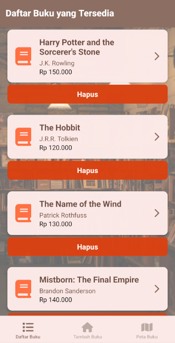
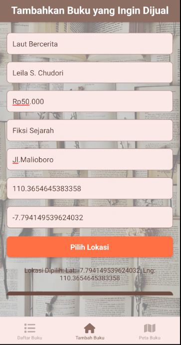
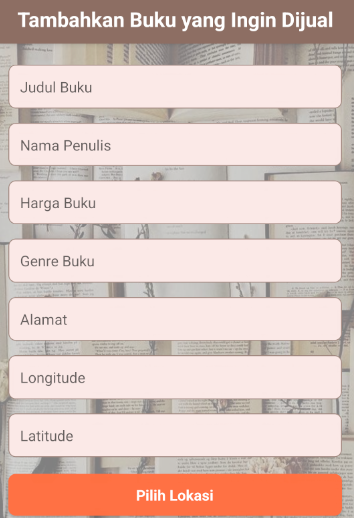
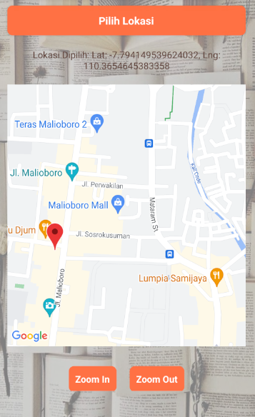
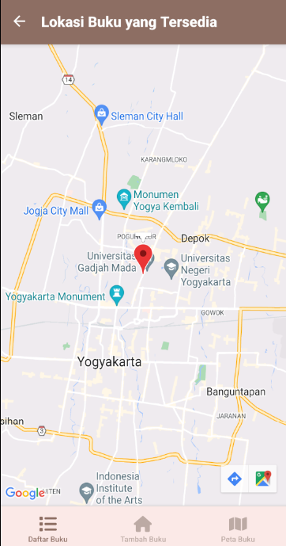
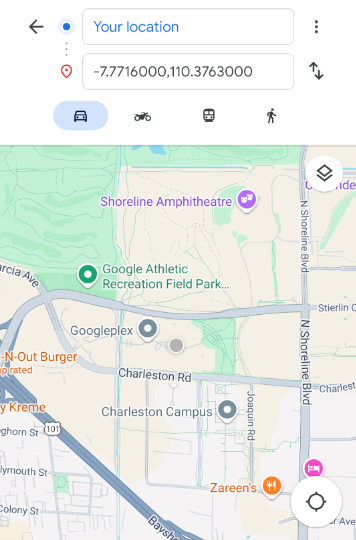

# 📚 **BookBuddy** 📚

**BookBuddy** adalah aplikasi mobile yang dirancang untuk memfasilitasi pembelian dan penjualan buku bekas. Aplikasi ini menghubungkan penggemar buku dengan cara yang mudah dan menyenangkan untuk menukar buku melalui platform yang ramah pengguna.

## 📝 **Deskripsi Produk**

**BookBuddy** adalah platform tempat pengguna dapat membeli dan menjual buku bekas. Aplikasi ini menyediakan antarmuka yang mudah digunakan, memungkinkan pengguna untuk:

- 🏷️ Memposting buku yang akan dijual
- 📖 Membuat listing buku
- 💬 Mencari rute terbaik sesuai lokasi penjual buku

Baik Anda mencari buku langka atau ingin menjual koleksi buku lama, **BookBuddy** adalah aplikasi yang sempurna untuk para pecinta buku! 📚✨

## ⚙️ **Komponen Pembangun Produk**

- **React Native**: Digunakan untuk membangun aplikasi mobile, memungkinkan kompatibilitas lintas platform (Android dan iOS) 🤖📱
- **Metro Bundler**: Menggabungkan file JavaScript untuk aplikasi React Native 🔧
- **JSON Server**: API palsu yang mensimulasikan layanan backend untuk aplikasi 📡
- **React Navigation**: Menangani navigasi antar layar di aplikasi 🔄
- **API Google Cloud Console**: Digunakan untuk memberikan akses pengguna ke layanan Google Maps 🌐

## 📦 **Sumber Data**

Sumber data utama aplikasi ini berasal dari **JSON Server**, yang menyimpan informasi tentang buku. Setiap data diambil menggunakan permintaan API untuk menampilkan informasi yang relevan di aplikasi. Selain itu, untuk foto background aplikasi, bersumber dari Pinterest. 💾📚

## 🖼️ **Tangkapan Layar Komponen Penting Produk**

1. **Tampilan List Buku** - Menampilkan daftar buku yang tersedia untuk dijual atau dibeli. 🏠📖  
   

2. **Tampilan Posting Buku** - Menampilkan form untuk memposting buku yang akan dijual. 📄💵  
     
     
   

3. **Maps** - Digunakan untuk memberi tahu pembeli lokasi dari penjual buku. ✍️📚

   a. **Lokasi Penjual Buku**  
      

   b. **Fitur Routing**  
      
